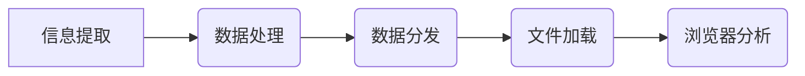
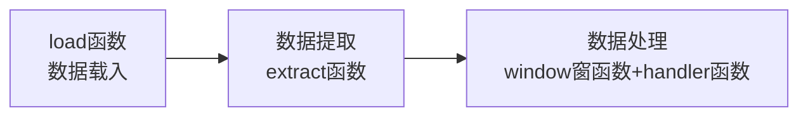
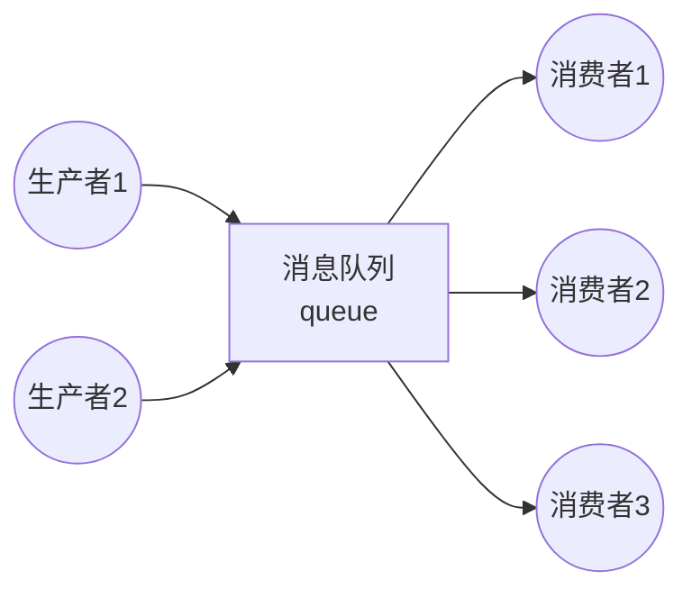

# 1 日志分析
**日志分析的重要性**：   
- 日志处理日志几乎是互联网的命根。用户在干什么、请求了什么、行为是什么都需要通过日志获取；
给用户做产品推荐，很大可能第一步处理就是从日志分析中获取到的数据，为用户做选择性推荐。  

**日志处理分类**：
- **离线处理**：从生成的文件中，一行行处理，这种方式称为离线处理。  
- **在线处理**：又称实时处理，用户访问的同时立马获取到用户行为日志，并推送到后台处理。  

***离线处理和在线处理是大数据的两个方向。大数据到最后，很大一部分工作就是做海量日志处理。***

**日志采集流程**：   
- 日志产出 -> 采集(搭建ELK，使用Logstash收集；大数据领域：Flume、Scribe；各有长处，根据项目选型，
甚至可能多级采集) -> 存储(落地) -> 分析 -> 数据存储:持久化(数据库、NoSQL) -> 可视化  
- 存储和分析之间，还有一个清洗过程。
## 1.1 开源日志分析平台ELK介绍
**ELK是三个开源软件的缩写，分别表示：Elasticsearch , Logstash, Kibana , 它们都是开源软件**：  
- **Elasticsearch**：是一个开源分布式搜索引擎，提供搜集、分析、存储数据三大功能  
- **Logstash**：主要是用来日志的搜集、分析、过滤日志的工具，支持大量的数据获取方式。  
- **Kibana**： 也是一个开源和免费的工具，Kibana可以为 Logstash 和 ElasticSearch 提供的日志分析
友好的 Web 界面，可以帮助汇总、分析和搜索重要数据日志。   

Logstash收集日志，并存放到Elasticsearch集群中，Kibana从ES集群中查询数据生产图标，返回到浏览器端
## 1.2 日志分析使用技术
- 半结构化数据：日志是半结构化数据，有组织有格式的数据。可以分割成行和列，当做表格处理。
- 文本分析：日志是文本文件，可以通过文件IO、字符串操作、正则表达等技术，把日志中需要的数据提取出来。
***
# 2 项目：Web Server日志分析
**需求描述**：nginx、tomcat等WEB Server会产生`log_strs`日志信息。需提取日志中的每一段有效数据，用作后期分析。  
`log_strs=123.125.71.36 - - [06/Apr/2017:18:09:25 +0800] "GET / HTTP/1.1" 200 8642 "-" "Mozilla/5.0 (compatible; Baiduspider/2.0; +http://www.baidu.com/search/spider.html)"`  
## 2.1 方案设计  
**日志分析流程图**：


## 2.2 方案实现
### 2.2.1 信息提取(extract message)
**信息提取策略**
- 按行提取日志中的remote、datetime、request、status、size、useragent信息； 
- datetime、status、size分别保存为datetime对象、int类型、int类型； 
- request提取为method、url、protocol。

**策略实现**：  
- datetime为固定格式[.* .*]，根据开头'['、结尾']'提取时间对象  
- url格式为"GET url protocol",根据开头、结尾为'"'提取

**代码实现方法一--空格分割**：  
```python
#!/usr/bin/env python3
# coding=utf-8
"""
@author: feng.luo
@time: 2022/4/5
@File: logger_analysis_1_extract_info.py
"""
import datetime

from tool.logger_define import LoggerDefine


logger = LoggerDefine(__name__).get_logger

_log_test_strs = '123.125.71.36 - - [06/Apr/2017:18:09:25 +0800] "GET /o2o/media.html?menu=3 HTTP/1.1" 200 8642 "-" ' \
                 '"Mozilla/5.0 (compatible; Baiduspider/2.0; +http://www.baidu.com/search/spider.html)"'


class LoggerAnalysisDemo:
    def __init__(self, log_path: str):
        self.log_path = log_path
        self.extract_fields = None

    def extract_info_by_split(self):
        """按空格分割提取信息

        time： [06/Apr/2017:18:09:25 +0800]
        request： "GET / HTTP/1.1"
        需处理time和request被分割的问题,以及其他双引号中内容被分割的问题
        """
        fields = []
        tmp_info = ''
        catch_flag, time_flag, quote_flag = False, False, False
        for field in self.log_path.split():
            if not catch_flag and field.startswith("["):
                catch_flag, time_flag = True, True
                if field.endswith("]"):
                    fields.append(field.strip("[]"))
                    catch_flag, time_flag = False, False
                else:
                    tmp_info += field.strip('[') + " "
                continue
            elif catch_flag and time_flag:
                if field.endswith("]"):
                    fields.append(tmp_info + field.strip("]"))
                    tmp_info = ''
                    catch_flag, time_flag = False, False
                else:
                    tmp_info += field + " "
                continue
            if not catch_flag and field.startswith('"'):
                catch_flag, quote_flag = True, True
                if field.endswith('"'):
                    fields.append(field.strip('"'))
                    catch_flag, quote_flag = False, False
                else:
                    tmp_info += field.strip('"') + " "
                continue
            elif catch_flag and quote_flag:
                if field.endswith('"'):
                    fields.append(tmp_info + field.strip('"'))
                    tmp_info = ''
                    catch_flag, quote_flag = False, False
                else:
                    tmp_info += field + " "
                continue
            fields.append(field)
        self.extract_fields = fields

    def convert_fields(self):
        """转换time、request、status、size类型
        """
        con_res = dict()
        names = ['remote', None, None, 'datatime', 'request',
                 'status', 'size', None, 'useragent']
        ops_lst = [None, None, None, self._convert_time, self._convert_request,
                   int, int, None, None]
        for idx, ops in enumerate(ops_lst):
            name = names[idx]
            if name:
                if ops:
                    con_res[name] = ops(self.extract_fields[idx])
                else:
                    con_res[name] = self.extract_fields[idx]
        return con_res

    @staticmethod
    def _convert_time(time_str: str):
        return datetime.datetime.strptime(time_str, "%d/%b/%Y:%H:%M:%S %z")

    @staticmethod
    def _convert_request(request_str: str):
        return dict(zip(('method', 'url', 'protocol'), request_str.split()))


if __name__ == '__main__':
    demo_obj = LoggerAnalysisDemo(_log_test_strs)
    demo_obj.extract_info_by_split()
    convert_res = demo_obj.convert_fields()
    logger.info('convert result by split  :{}'.format(convert_res))
```  
**代码实现方法二--正则匹配**：
```python
#!/usr/bin/env python3
# coding=utf-8
"""
@author: feng.luo
@time: 2022/4/5
@File: logger_analysis_1_extract_info.py
"""
import datetime
import re

from tool.logger_define import LoggerDefine


logger = LoggerDefine(__name__).get_logger

_log_test_strs = '123.125.71.36 - - [06/Apr/2017:18:09:25 +0800] "GET /o2o/media.html?menu=3 HTTP/1.1" 200 8642 "-" ' \
                 '"Mozilla/5.0 (compatible; Baiduspider/2.0; +http://www.baidu.com/search/spider.html)"'


def extract_info_by_regular_expression():
    pattern = r'(?P<remote>[\d.]{7,}) - - \[(?P<datetime>[^\[\]]+)\] "(?P<request>[^"]+)" ' \
              r'(?P<status>\d+) (?P<size>\d+) "-" "(?P<useragent>[^"]+)"'
    regex = re.compile(pattern)
    re_obj = regex.match(_log_test_strs)
    ops = {
        'datetime': lambda time_str: datetime.datetime.strptime(time_str, "%d/%b/%Y:%H:%M:%S %z"),
        'request': lambda request_str: dict(zip(('method', 'url', 'protocol'), request_str.split())),
        'status': int,
        'size': int
    }
    return dict((k, ops.get(k, lambda x: x)(v)) for k, v in re_obj.groupdict().items())


if __name__ == '__main__':
    con_regular_res = extract_info_by_regular_expression()
    logger.info('Convert result by regular:{}'.format(con_regular_res))
```

### 2.2.2 数据处理(analysis date)
**1. 数据处理流程**  

**2. 时序数据**： 运维环境中，日志、监控等产生的数据都是与时间相关的数据，按照时间先后产生并记录下来的数据，
所以一般按照时间对数据进行分析。  

**数据载入**：数据就是日志的一行行记录，载入数据就是文件IO的读取。将获取数据的方法封装成函数，
实现数据载入。  

**数据分析**：很多数据，都是和时间相关的，按照时间顺序产生的，数据分析的时候，需要按照时间求值。
所以一般采用时间窗分析。
- 时间窗分析：   
    - interval：表示每一次求值的时间间隔   
    - width：时间宽度，指每一次求值的时间窗口宽度。当width > interval时：数据求值会有重叠；
  否则数据会有丢失，一般不采用这种方案。

- 数据处理：封装handler函数用于处理时间窗函数获取的数据。handler函数由用户需求自定义传入。
```python
#!/usr/bin/env python3
# coding=utf-8
"""
@author: feng.luo
@time: 2022/4/6
@File: logger_analysis_2_handle_info.py
"""

import datetime

from tool.logger_define import LoggerDefine
from logger_analysis_1_extract_info import RegularExtract


logger = LoggerDefine(__name__).get_logger


class HandleInfo(RegularExtract):
    """
    数据分析基本程序结构：数据加载（load函数） -- 数据提取（extract函数）-- 数据处理（window窗函数 + handler函数）
    """
    def __init__(self):
        super().__init__()

    def source_load(self, path):
        """载入数据"""
        with open(path, encoding='utf8') as f:
            for line in f:
                field = self.extract_info_by_regular_expression(line)
                if field:
                    yield field
                else:
                    continue  # TODO 解析失败处理：抛异常或打印error日志

    @staticmethod
    def window(src, handler, width, interval):
        """时间窗口函数

        :param src: 数据源，生成器，取数据
        :param handler: 数据处理函数
        :param width: 时间窗口宽度，秒
        :param interval: 处理时间间隔，秒
        """
        start = datetime.datetime.strptime("1970/01/01 01:01:01 +0800", "%Y/%m/%d %H:%M:%S %z")
        delta = datetime.timedelta(seconds=width-interval)
        buffer = []  # 窗口中待计算的数据
        for data in src:
            if not data:
                continue
            # 存入buffer中等待计算
            current = data['datetime']
            buffer.append(data)
            if (current - start).total_seconds() >= interval:
                ret = handler(buffer)
                # 打印结果
                print('ret:{}'.format(ret))
                start = current
                buffer = [x for x in buffer if x['datetime'] > current - delta]

    @staticmethod
    def handler_method(iterable):
        """
        数据处理函数
        """
        vals = [x['value'] for x in iterable]
        return sum(vals) // len(vals)


if __name__ == '__main__':
    hand = HandleInfo()
    hand.window(hand.source_load('test.log'), hand.handler_method, 8, 5)
```


### 2.2.3 数据分发
**生产者消费者模型**： 编程中凡是有上下级关系的，都可以称为生产者消费者模型。 
这种模型，速度很难做到统一，因此有了消息队列，起到缓冲作用。
水库，干涸期和**期，但是水库蓄洪也有能力的，所以消息队列也有上限。
**消费者能力一般要大于生产者，略大于都不行，万一有一个消费者挂了呢。**


    
    
    
### 2.2.4 文件加载及分析器
### 2.2.5 浏览器分析


**参考链接**：[https://blog.csdn.net/qq_43141726/article/details/114583115?ops_request_misc=&request_id=&biz_id=102&spm=1018.2226.3001.4187]()
