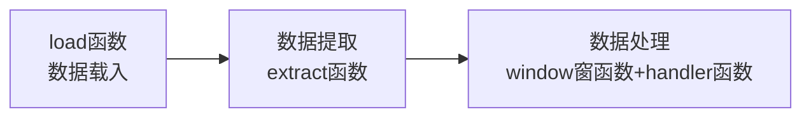
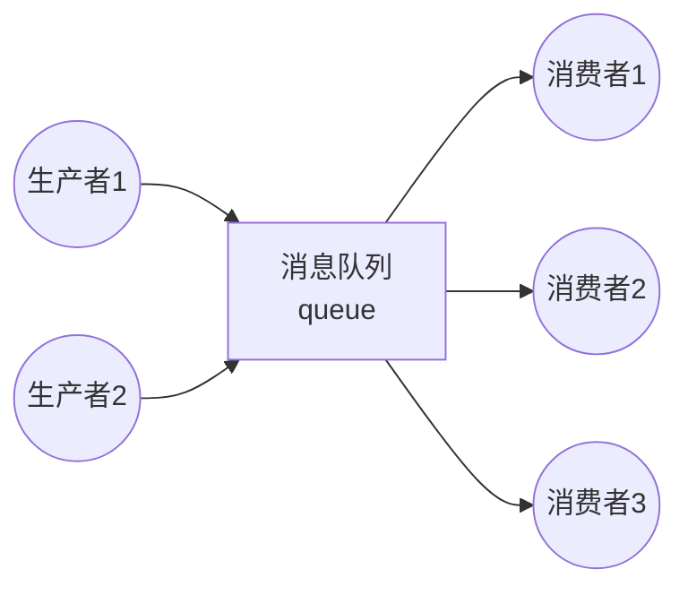

# 1 日志分析
**日志分析的重要性**：   
- 日志处理日志几乎是互联网的命根。用户在干什么、请求了什么、行为是什么都需要通过日志获取；
给用户做产品推荐，很大可能第一步处理就是从日志分析中获取到的数据，为用户做选择性推荐。  

**日志处理分类**：
- **离线处理**：从生成的文件中，一行行处理，这种方式称为离线处理。  
- **在线处理**：又称实时处理，用户访问的同时立马获取到用户行为日志，并推送到后台处理。  

***离线处理和在线处理是大数据的两个方向。大数据到最后，很大一部分工作就是做海量日志处理。***

**日志采集流程**：   
- 日志产出 -> 采集(搭建ELK，使用Logstash收集；大数据领域：Flume、Scribe；各有长处，根据项目选型，
甚至可能多级采集) -> 存储(落地) -> 分析 -> 数据存储:持久化(数据库、NoSQL) -> 可视化  
- 存储和分析之间，还有一个清洗过程。
## 1.1 开源日志分析平台ELK介绍
**ELK是三个开源软件的缩写，分别表示：Elasticsearch , Logstash, Kibana , 它们都是开源软件**：  
- **Elasticsearch**：是一个开源分布式搜索引擎，提供搜集、分析、存储数据三大功能  
- **Logstash**：主要是用来日志的搜集、分析、过滤日志的工具，支持大量的数据获取方式。  
- **Kibana**： 也是一个开源和免费的工具，Kibana可以为 Logstash 和 ElasticSearch 提供的日志分析
友好的 Web 界面，可以帮助汇总、分析和搜索重要数据日志。   

Logstash收集日志，并存放到Elasticsearch集群中，Kibana从ES集群中查询数据生产图标，返回到浏览器端
## 1.2 日志分析使用技术
- 半结构化数据：日志是半结构化数据，有组织有格式的数据。可以分割成行和列，当做表格处理。
- 文本分析：日志是文本文件，可以通过文件IO、字符串操作、正则表达等技术，把日志中需要的数据提取出来。
***
# 2 项目：Web Server日志分析
**需求描述**：nginx、tomcat等WEB Server会产生`log_strs`日志信息。需提取日志中的每一段有效数据，用作后期分析。  
`log_strs=123.125.71.36 - - [06/Apr/2017:18:09:25 +0800] "GET / HTTP/1.1" 200 8642 "-" "Mozilla/5.0 (compatible; Baiduspider/2.0; +http://www.baidu.com/search/spider.html)"`  
## 2.1 方案设计  
**日志分析流程图**：


## 2.2 方案实现
### 2.2.1 信息提取(extract message)
**信息提取策略**
- 按行提取日志中的remote、datetime、request、status、size、useragent信息； 
- datetime、status、size分别保存为datetime对象、int类型、int类型； 
- request提取为method、url、protocol。

**策略实现**：  
- datetime为固定格式[.* .*]，根据开头'['、结尾']'提取时间对象  
- url格式为"GET url protocol",根据开头、结尾为'"'提取

**代码实现方法一--空格分割**：  
```python
#!/usr/bin/env python3
# coding=utf-8
import datetime

from tool.logger_define import LoggerDefine


logger = LoggerDefine(__name__).get_logger

_log_test_strs = '123.125.71.36 - - [06/Apr/2017:18:09:25 +0800] "GET /o2o/media.html?menu=3 HTTP/1.1" 200 8642 "-" ' \
                 '"Mozilla/5.0 (compatible; Baiduspider/2.0; +http://www.baidu.com/search/spider.html)"'


class LoggerAnalysisDemo:
    def __init__(self, log_path: str):
        self.log_path = log_path
        self.extract_fields = None

    def extract_info_by_split(self):
        """按空格分割提取信息

        time： [06/Apr/2017:18:09:25 +0800]
        request： "GET / HTTP/1.1"
        需处理time和request被分割的问题,以及其他双引号中内容被分割的问题
        """
        fields = []
        tmp_info = ''
        catch_flag, time_flag, quote_flag = False, False, False
        for field in self.log_path.split():
            if not catch_flag and field.startswith("["):
                catch_flag, time_flag = True, True
                if field.endswith("]"):
                    fields.append(field.strip("[]"))
                    catch_flag, time_flag = False, False
                else:
                    tmp_info += field.strip('[') + " "
                continue
            elif catch_flag and time_flag:
                if field.endswith("]"):
                    fields.append(tmp_info + field.strip("]"))
                    tmp_info = ''
                    catch_flag, time_flag = False, False
                else:
                    tmp_info += field + " "
                continue
            if not catch_flag and field.startswith('"'):
                catch_flag, quote_flag = True, True
                if field.endswith('"'):
                    fields.append(field.strip('"'))
                    catch_flag, quote_flag = False, False
                else:
                    tmp_info += field.strip('"') + " "
                continue
            elif catch_flag and quote_flag:
                if field.endswith('"'):
                    fields.append(tmp_info + field.strip('"'))
                    tmp_info = ''
                    catch_flag, quote_flag = False, False
                else:
                    tmp_info += field + " "
                continue
            fields.append(field)
        self.extract_fields = fields

    def convert_fields(self):
        """转换time、request、status、size类型
        """
        con_res = dict()
        names = ['remote', None, None, 'datatime', 'request',
                 'status', 'size', None, 'useragent']
        ops_lst = [None, None, None, self._convert_time, self._convert_request,
                   int, int, None, None]
        for idx, ops in enumerate(ops_lst):
            name = names[idx]
            if name:
                if ops:
                    con_res[name] = ops(self.extract_fields[idx])
                else:
                    con_res[name] = self.extract_fields[idx]
        return con_res

    @staticmethod
    def _convert_time(time_str: str):
        return datetime.datetime.strptime(time_str, "%d/%b/%Y:%H:%M:%S %z")

    @staticmethod
    def _convert_request(request_str: str):
        return dict(zip(('method', 'url', 'protocol'), request_str.split()))


if __name__ == '__main__':
    demo_obj = LoggerAnalysisDemo(_log_test_strs)
    demo_obj.extract_info_by_split()
    convert_res = demo_obj.convert_fields()
    logger.info('convert result by split  :{}'.format(convert_res))
```  
**代码实现方法二--正则匹配**：
```python
#!/usr/bin/env python3
# coding=utf-8
"""
@author: feng.luo
@time: 2022/4/5
@File: logger_analysis_1_extract_info.py
"""
import datetime
import re

from tool.logger_define import LoggerDefine


logger = LoggerDefine(__name__).get_logger

_log_test_strs = '123.125.71.36 - - [06/Apr/2017:18:09:25 +0800] "GET /o2o/media.html?menu=3 HTTP/1.1" 200 8642 "-" ' \
                 '"Mozilla/5.0 (compatible; Baiduspider/2.0; +http://www.baidu.com/search/spider.html)"'


def extract_info_by_regular_expression():
    pattern = r'(?P<remote>[\d.]{7,}) - - \[(?P<datetime>[^\[\]]+)\] "(?P<request>[^"]+)" ' \
              r'(?P<status>\d+) (?P<size>\d+) "-" "(?P<useragent>[^"]+)"'
    regex = re.compile(pattern)
    re_obj = regex.match(_log_test_strs)
    ops = {
        'datetime': lambda time_str: datetime.datetime.strptime(time_str, "%d/%b/%Y:%H:%M:%S %z"),
        'request': lambda request_str: dict(zip(('method', 'url', 'protocol'), request_str.split())),
        'status': int,
        'size': int
    }
    return dict((k, ops.get(k, lambda x: x)(v)) for k, v in re_obj.groupdict().items())


if __name__ == '__main__':
    con_regular_res = extract_info_by_regular_expression()
    logger.info('Convert result by regular:{}'.format(con_regular_res))
```

### 2.2.2 数据处理(analysis date)
**1. 数据处理流程**  

**2. 时序数据**： 运维环境中，日志、监控等产生的数据都是与时间相关的数据，按照时间先后产生并记录下来的数据，
所以一般按照时间对数据进行分析。  

**数据载入**：数据就是日志的一行行记录，载入数据就是文件IO的读取。将获取数据的方法封装成函数，
实现数据载入。  

**数据分析**：很多数据，都是和时间相关的，按照时间顺序产生的，数据分析的时候，需要按照时间求值。
所以一般采用时间窗分析。
- 时间窗分析：   
    - interval：表示每一次求值的时间间隔   
    - width：时间宽度，指每一次求值的时间窗口宽度。当width > interval时：数据求值会有重叠；
  否则数据会有丢失，一般不采用这种方案。

- 数据处理：封装handler函数用于处理时间窗函数获取的数据。handler函数由用户需求自定义传入。
```python
#!/usr/bin/env python3
# coding=utf-8
import datetime

from tool.logger_define import LoggerDefine
from logger_analysis_1_extract_info import RegularExtract


logger = LoggerDefine(__name__).get_logger


class HandleInfo(RegularExtract):
    """
    数据分析基本程序结构：数据加载（load函数） -- 数据提取（extract函数）-- 数据处理（window窗函数 + handler函数）
    """
    def __init__(self):
        super().__init__()

    def source_load(self, path):
        """载入数据"""
        with open(path, encoding='utf8') as f:
            for line in f:
                field = self.extract_info_by_regular_expression(line)
                if field:
                    yield field
                else:
                    continue  # TODO 解析失败处理：抛异常或打印error日志

    @staticmethod
    def window(src, handler, width, interval):
        """时间窗口函数

        :param src: 数据源，生成器，取数据
        :param handler: 数据处理函数
        :param width: 时间窗口宽度，秒
        :param interval: 处理时间间隔，秒
        """
        start = datetime.datetime.strptime("1970/01/01 01:01:01 +0800", "%Y/%m/%d %H:%M:%S %z")
        delta = datetime.timedelta(seconds=width-interval)
        buffer = []  # 窗口中待计算的数据
        for data in src:
            if not data:
                continue
            # 存入buffer中等待计算
            current = data['datetime']
            buffer.append(data)
            if (current - start).total_seconds() >= interval:
                ret = handler(buffer)
                # 打印结果
                print('ret:{}'.format(ret))
                start = current
                buffer = [x for x in buffer if x['datetime'] > current - delta]

    @staticmethod
    def handler_method(iterable):
        """
        数据处理函数
        """
        vals = [x['value'] for x in iterable]
        return sum(vals) // len(vals)


if __name__ == '__main__':
    hand = HandleInfo()
    hand.window(hand.source_load('test.log'), hand.handler_method, 8, 5)
```
****

### 2.2.3 数据分发--使用生产者消费者模型
**生产者消费者模型**： 以寄信为例： 生产者 -- 缓冲区 -- 消费者  
- 1、写信的人 -- 制造数据，生产者
- 2、投递信到邮箱 -- 数据放入缓冲区
- 3、邮递员把信拿到邮局分发到目的地 -- 处理数据，消费者。  

**使用生产者-消费者模型好处**：
- 1、解耦：写信人和邮递员看似无关，如无邮箱，则有强耦合关系。写信的人必须认识邮递员，且必须在固定的时间、
地点等候邮递员取信；如果邮递员请教请假或换人了，还需要重新认识邮递员。可见，通过邮箱的，解决了生产者
和消费者的依赖关系。
- 2、并发，提高效率：寄信要一直在邮递员取信的地点等，很费时间，还可能等不到。通过信箱，所有寄信的人写好
信后直接往邮箱里投，不用等；邮递员也不用挨家挨户的上门取信，只需从邮箱一次拿走。可见，生产者-消费者模
型可以极大提高效率。
- 3、支持忙闲不均：遇到节假日信封、包裹较多，邮递员一次拿不走，还可以留在邮箱，下次再拿。可见，生产者-消
费者模型还可以解决生产者、消费者能力不均衡的问题。  

**生产者-消费者模型三种关系**：  
- 生产者与生产者 -- 互斥
- 消费者与消费者 -- 互斥
- 生产者与消费者 -- 同步与互斥

**互斥**：线程锁的问题，保证线程安全。比如，某一时刻生产者1从缓冲区拿数据data1，其他生产者不能在这一时
刻拿数据，避免产生重复、甚至错误结果。

**总结：**  

- 广义的凡有上下级数据传输打过程，都可以称为生产者消费者模型。这种模型，速度很难做到统一，因此需要消息队列，
起到缓冲作用。另外，生产者生产速度不稳定，有可能造成短时间数据的'潮涌'，需要缓冲；不同消费者能力也不一样
，通过数据缓冲，可以差异化决定消费缓冲区中数据的速度。
- 水库有干涸期和蓄洪期，但是水库蓄洪也有能力的，所以消息队列也有上限。
- 消费者能力一般要大于生产者，略大于都不行，万一有一个消费者挂了呢。
- 单机可以使用内建模块queue，构建进程内的队列，满足多个线程间的生产、消费需求。大型系统，可以使用中间
件，例如RabbitMQ、RocketMQ、kafka。


**通过分发器（调度器）实现数据分发：**   
**大量数据处理：** 通过分发器，将数据分发给多个消费者处理数据；每个消费者拿到后，通过同一个窗函数处理
数据 （不同的handler、width、interval），因此要有函数注册机制。  
**方案流程：** 数据加载load -> 数据提取extract -> 函数注册与数据分发  
&emsp;&emsp;&emsp;&emsp;&emsp;&emsp;&emsp;&emsp;&emsp;&emsp;&emsp;&emsp;&emsp;
&emsp;&emsp;&emsp;&emsp;&emsp;&emsp;&ensp;&emsp;&emsp;&ensp;&emsp;&emsp;|->消费者1数据分析window(handler1, width1, interval1)  
&emsp;&emsp;&emsp;&emsp;&emsp;&emsp;&emsp;&emsp;&emsp;&emsp;&emsp;&emsp;&emsp;
&emsp;&emsp;&emsp;&emsp;&emsp;&emsp;&ensp;&emsp;&emsp;&ensp;&emsp;&emsp;|-- 消费者2数据分析window(handler2, width2, interval2)   
&emsp;&emsp;&emsp;&emsp;&emsp;&emsp;&emsp;&emsp;&emsp;&emsp;&emsp;&emsp;&emsp;
&emsp;&emsp;&emsp;&emsp;&emsp;&emsp;&ensp;&emsp;&emsp;&ensp;&emsp;&emsp;|-- 消费者3数据分析window(handler3, width3, interval3)  
**数据分发**：轮询，一对多的，多副本方式，把同一份数据分发给不同的消费者处理。  
**使用消息队列**：数据载入后，每一个消费者各自有一个消息队列，数据分发给到消费者的消息队列中。  
**函数注册**：使用多线程，每一个消费者对应一个线程实例，调度器记录有哪些消费者，以及消费者的数据处理队列。

**queue模块：** 提供一个先进先出的队列。  
>q = queue.Queue(maxsize=0):创建FIFO队列，返回Queue对象。当maxsize<=0，队列长度没有限制。
>>q.get(block=True,timeout=None): 从队列中移除元素，并返回这个元素；  
block=True，为阻塞；block=False，未拿到数据直接抛empty异常，设置timeout无效。
timeout=None，表示不设超时，未拿到数据一直阻塞；timeout=5，阻塞5秒，未拿到数据抛empty异常。  
>>q.put(item,block=True,timeout=None):把一个元素item加入到队列中去。   
>>还有q.get_nowait(),q.put_nowait(item)方法  

**代码实现**
```python
#!/usr/bin/env python3
# coding=utf-8
import datetime
import queue
import re
import threading
import traceback
from queue import Queue

from tool.logger_define import LoggerDefine


logger = LoggerDefine(__name__).get_logger
_log_test_strs = '123.125.71.36 - - [06/Apr/2017:18:09:25 +0800] "GET /o2o/media.html?menu=3 HTTP/1.1" 200 8642 "-" ' \
                 '"Mozilla/5.0 (compatible; Baiduspider/2.0; +http://www.baidu.com/search/spider.html)"'
pattern = r'(?P<remote>[\d.]{7,}) - - \[(?P<datetime>[^\[\]]+)\] "(?P<request>[^"]+)" (?P<status>\d+) (?P<size>\d+) "-"' \
          ' "(?P<useragent>[^"]+)"'
regex = re.compile(pattern)
ops = {
    "datetime": lambda x: datetime.datetime.strptime(x, "%d/%b/%Y:%H:%M:%S %z"),
    "request": lambda x: dict(zip(('method', 'url', 'protocol'), x)),
    "status": int,
    "size": int
}


#####################################################################################
# 数据加载与提取
def extract_info(line: str):
    ret = regex.match(line)
    if ret:
        return dict((k, ops.get(k, lambda x: x)(v)) for k, v in ret.groupdict().items())


def load_info(path: str):
    with open(path, encoding='utf8') as f:
        for line in f:
            ret = extract_info(line)
            if ret:
                yield ret


src_info = load_info('test.log')


#####################################################################################
# 时间窗口函数
def window(src: Queue, handler, width: int, interval: int):
    start_time = datetime.datetime.strptime('1970/01/01 01:01:01 +0800', "%Y/%m/%d %H:%M:%S %z")
    delta = datetime.timedelta(seconds=width-interval)
    buffer = []
    while True:
        try:
            data = src.get(timeout=5)
        except queue.Empty:
            err_msg = traceback.format_exc()
            logger.error('Error: {}'.format(err_msg))
            return
        if not data:
            continue
        current = data['datetime']
        buffer.append(data)
        if (current - start_time).total_seconds() > interval:
            ret = handler(buffer)
            print(ret)
            buffer = [x for x in buffer if x['datetime'] > current - delta]
            start_time = current


def do_nothing_handler(iterable):
    print(iterable)
    return iterable


#####################################################################################
# 分发器
def dispatcher():
    threads = []
    queues = []

    def _reg(handler, width, interval):
        # 注册函数：实例化一个线程对象，并保存；每一个线程各自有一个队列，保存自己要处理的数据
        src = Queue()
        queues.append(src)
        t = threading.Thread(target=window, args=(src, handler, width, interval))
        threads.append(t)

    def _run():
        # 数据分发；并调度函数，各自处理数据
        for t in threads:
            t.start()
        # 数据分发
        for data in src_info:
            for q in queues:
                q.put(data)
    return _reg, _run


reg, run = dispatcher()

# 注册窗口
reg(do_nothing_handler, 8, 5)

# 启动：数据分发并调度函数处理数据
run()
```
***封装为类,继承类HandleInfo***
```python
import datetime
import queue
import threading
import traceback
from queue import Queue

from tool.logger_define import LoggerDefine
from logger_analysis_2_handle_info import HandleInfo


logger = LoggerDefine(__name__).get_logger


class DispatcherInfo(HandleInfo):
    def __init__(self):
        super(DispatcherInfo, self).__init__()
        # 数据加载与提取
        self.src_info = self.source_load('test.log')

    # 时间窗口函数
    @staticmethod
    def window(src: Queue, handler, width: int, interval: int):
        start_time = datetime.datetime.strptime('1970/01/01 01:01:01 +0800', "%Y/%m/%d %H:%M:%S %z")
        delta = datetime.timedelta(seconds=width-interval)
        buffer = []
        while True:
            try:
                data = src.get(timeout=2)
            except queue.Empty:
                err_msg = traceback.format_exc()
                logger.error('Error: {}'.format(err_msg))
                return
            if not data:
                continue
            current = data['datetime']
            buffer.append(data)
            if (current - start_time).total_seconds() > interval:
                ret = handler(buffer)
                print(ret)
                buffer = [x for x in buffer if x['datetime'] > current - delta]
                start_time = current

    @staticmethod
    def do_nothing_handler(iterable):
        return iterable

    # 分发器
    def dispatcher(self):
        """分发器（调度器）
        """
        threads = []
        queues = []

        def _reg(handler, width, interval):
            # 注册函数：实例化一个线程对象，并保存；每一个线程各自有一个队列，保存自己要处理的数据
            src = Queue()
            queues.append(src)
            t = threading.Thread(target=self.window, args=(src, handler, width, interval))
            threads.append(t)

        def _run():
            # 数据分发；并调度函数，各自处理数据
            for t in threads:
                t.start()
            # 数据分发
            for data in self.src_info:
                for q in queues:
                    q.put(data)
        return _reg, _run


if __name__ == '__main__':
    analysis = DispatcherInfo()
    reg, run = analysis.dispatcher()
    # 注册窗口
    reg(analysis.do_nothing_handler, 8, 5)
    # 启动：数据分发并调度函数处理数据
    run()
```


### 2.2.4 文件加载及状态码分析
**完成状态码分析功能：**  
分析日志状态码很重要，通过海量数据分析就能够知道是否遭受了攻击，是否被爬取及爬取高峰期，是否有盗链等。
百度爬虫名称：Baiduspider；
谷歌爬虫名称：Googlebot

**优化数据加载**：支持批量文件加载

**代码实现--继承类DispatcherInfo**
```python
import pathlib

from tool.logger_define import LoggerDefine
from logger_analysis_3_dispatcher_info import DispatcherInfo


logger = LoggerDefine(__name__).get_logger


class AnalysisInfo(DispatcherInfo):
    def __init__(self):
        super(AnalysisInfo, self).__init__()
        self.src_info = self.load_info('test.log')

    def load_info(self, *paths):
        """数据加载

        接收一批路径加载，判断路径是否存在。如果路径为普通文件，则当日志处理；如果为目录，则迭代目录下的普通文件，不深层次递归。
        """
        file_lst = []
        for path in paths:
            p = pathlib.Path(path)
            if not p.exists():
                continue
            if p.is_dir():
                file_lst.extend([f for f in p.iterdir() if f.is_file() and not str(f).startswith('.')])
            elif p.is_file():
                file_lst.append(p)
        for p in file_lst:
            yield from self.open_file(p)

    def open_file(self, path: pathlib.Path):
        with path.open(encoding='utf8') as f:
            for line in f:
                ret = self.extract_info_by_regular_expression(line)
                if ret:
                    yield ret
                else:
                    # TODO 未解析到信息抛出或打印日志
                    continue

    @staticmethod
    def status_handler(iterable):
        """状态分析

        状态码中包含了很多信息：比如：
        304，服务器收到客户端提交的请求参数，发现资源未变化，要求浏览器使用静态资源的缓存。304占比较大，说明静态缓存效果明显，服务器压力较小。
        404，服务器找不到请求的资源。404占比较大，说明html中出现了错误链接，或者尝试嗅探网站资源。
        如果400、500占比突然开始增大，网站肯定出现了问题。
        """
        ret = {}
        total = len(iterable)
        for data in iterable:
            status = data['status']
            if not ret.get(status):
                ret[status] = 0
            ret[status] += 1
        return {k: float('{:.2f}'.format(v/total*100)) for k, v in ret.items()}


if __name__ == '__main__':
    analysis_info = AnalysisInfo()
    # 数据分发与函数调度
    reg, run = analysis_info.dispatcher()
    # 注册窗口
    reg(analysis_info.status_handler, 8, 5)
    # 启动：数据分发并调度函数处理数据
    run()
```
### 2.2.5 浏览器分析
**浏览器分析：useragent**  
useragent：指的是软件（浏览器）安装一定的格式向远端的服务器提供一个标识自己的字符串。
useragent: 客户端信息，包含用户类型、什么操作系统、浏览器类型（IE、chrome）、浏览器版本、
浏览器核心、spider等信息。  
- http协议中，在http头传送user-agent字段。 user-agent可以随意修改。
- chrome查看useragent：F12进入控制台--Console--navigator.userAgent。
- chrome useragent: 'Mozilla/5.0 (Windows NT 10.0; Win64; x64) 
AppleWebKit/537.36 (KHTML, like Gecko) Chrome/95.0.4638.54 Safari/537.36'  

***分析useragent，可以查看大部分用户浏览器版本，然后可以做对应的版本兼容适配，满足大部分用户需求***  

**浏览器browser分析和状态码status分析的差异在于：**  
- status分析，关注的是某一段时间内，状态码所占的比例，进而分析网站的效率、网站状态、是否有嗅探等。
- browser分析，关注很长一段时间内，用户所使用的浏览器是什么，进而做兼容适配，提升用户体验，指导测
试侧重点。
- 因此，status分析width、interval可能需要时间重叠，数据分析也是按interval进行；browser分析
则不需要时间重叠，切统计了从开始到最后的总体数据

**browser分析用到的模块**： pyyaml、ua-parser、user-agents

**代码实现**  
```python
import collections
import datetime
from user_agents import parse

from logger_analysis_4_analysis_info import AnalysisInfo


class WebAnalysis(AnalysisInfo):
    def __init__(self):
        super(WebAnalysis, self).__init__()
        self.ops = {
            'datetime': lambda time_str: datetime.datetime.strptime(time_str, "%d/%b/%Y:%H:%M:%S %z"),
            'request': lambda request_str: dict(zip(('method', 'url', 'protocol'), request_str.split())),
            'status': int,
            'size': int,
            'useragent': lambda us: parse(us)
        }
        self.ua_dict = collections.defaultdict(lambda: 0)

    def browser_handler(self, iterable):
        for data in iterable:
            ua = data['useragent']
            self.ua_dict[ua.browser.family, ua.browser.version_string] += 1
        return self.ua_dict


if __name__ == '__main__':
    log_analysis = WebAnalysis()
    # 数据分发与函数调度
    reg, run = log_analysis.dispatcher()
    # 注册函数
    reg(log_analysis.status_handler, 10, 5)
    reg(log_analysis.browser_handler, 10, 10)
    # 函数调度
    run()
```
# 3 日志分析完整代码
**web server日志分析（status分析和useragent）流程：** 信息加载与提取：load函数和extract函数
-> 数据采集与处理：滑动窗口window函数和handler函数 -> 最终落地需要采用生产者消费者模型，通过多
线程实现数据分发、数据缓冲和函数调度，多任务高效处理不同分析信息的需求：dispatcher函数  

**完整代码**
```python
#!/usr/bin/env python3
# coding=utf-8
import collections
import datetime
import pathlib
import queue
import re
import threading
import traceback

import user_agents

from tool.logger_define import LoggerDefine


logger = LoggerDefine(__name__).get_logger

_log_test_strs = '123.125.71.36 - - [06/Apr/2017:18:09:25 +0800] "GET /o2o/media.html?menu=3 HTTP/1.1" 200 8642 "-" ' \
                 '"Mozilla/5.0 (compatible; Baiduspider/2.0; +http://www.baidu.com/search/spider.html)"'
pattern = r'(?P<remote>[\d.]{7,}) - - \[(?P<datetime>[^\[\]]+)\] "(?P<request>[^"]+)" (?P<status>\d+) (?P<size>\d+) "-" "(?P<useragent>[^"]+)"'
regex = re.compile(pattern)
ops = {
    "datetime": lambda x: datetime.datetime.strptime(x, "%d/%b/%Y:%H:%M:%S %z"),
    "request": lambda x: {zip(('method', 'url', 'protocol'), x.split())},
    "status": int,
    "size": int,
    "useragent": lambda x: user_agents.parse(x)
}


# 数据提取和加载
def source_load(*paths):
    path_list = []
    for path in paths:
        p = pathlib.Path(path)
        if not p.exists():
            continue
        if p.is_file():
            path_list.append(p)
        elif p.is_dir():
            path_list.extend([pathlib.Path(f) for f in p.iterdir() if f.is_file() and not str(f).startswith('.')])
    for p in path_list:
        yield from open_file(p)


def open_file(path: pathlib.Path):
    with path.open(encoding='utf8') as f:
        for line in f:
            ret_dic = extract(line)
            if ret_dic:
                yield ret_dic
            else:
                # todo 抛异常或打印error日志，统计未解析成功的日志
                continue


def extract(line: str):
    ret = regex.match(line)
    if ret:
        return {k: ops.get(k, lambda x: x)(v) for k, v in ret.groupdict().items()}


# 数据采集和处理
def window(src: queue.Queue, handler, width: int, interval: int):
    """按宽度width采集数据，并将采集的数据穿个handler处理

    :param src: 加载的数据, 生成器
    :param handler: 数据处理函数
    :param width: 数据采集宽度
    :param interval: 数据采集间隔
    :return:
    """
    start_time = datetime.datetime.strptime('1970/01/01 01:01:01 +0800', "%Y/%m/%d %H:%M:%S %z")
    delta = datetime.timedelta(width - interval)
    buffer = []
    while True:
        try:
            data = src.get(timeout=2)
        except queue.Empty:
            err_msg = traceback.format_exc()
            logger.error('Error:{}'.format(err_msg))
            return
        if not data:
            continue
        current = data['datetime']
        buffer.append(data)
        if (current - start_time).total_seconds() > interval:
            ret = handler(buffer)
            # 打印结果
            print(ret)
            start_time = current
            buffer = [d for d in buffer if current - d['datetime'] < delta]


def status_handler(iterable):
    s = dict()
    for data in iterable:
        status = data['status']
        if not s.get(status):
            s[status] = 0
        s[status] += 1
    total = sum(s.values())
    return {k: float('{:.2f}'.format(v/total*100)) for k, v in s.items()}


browser_ret = collections.defaultdict(lambda: 0)


def browser_handler(iterable):
    for data in iterable:
        ua = data['useragent']
        browser_ret[ua.browser.family, ua.browser.version_string] += 1
    return browser_ret


# 数据分发和函数调度
def dispatcher():
    """
    函数注册：即为数据处理函数实例化一个线程和传入函数参数
    函数分发：起线程分析数据
    # 调度器需要记录每一个注册函数的队列，以便于为每一个函数（消费者）分发数据
    :return:
    """
    threads = []
    queues = []

    def _reg(handler, width, interval):
        q = queue.Queue()
        queues.append(q)
        t = threading.Thread(target=window, args=(q, handler, width, interval))
        threads.append(t)

    def _run():
        for t in threads:
            t.start()
        for data in loaded_src:
            for q in queues:
                q.put(data)
    return _reg, _run


if __name__ == '__main__':
    # 数据载入
    loaded_src = source_load('test.log')
    # 数据分发和函数调度
    reg, run = dispatcher()
    # 函数注册
    reg(status_handler, 10, 5)
    reg(browser_handler, 10, 10)
    # 函数调度
    run()

```


**参考链接**：[https://blog.csdn.net/qq_43141726/article/details/114583115?ops_request_misc=&request_id=&biz_id=102&spm=1018.2226.3001.4187]()
